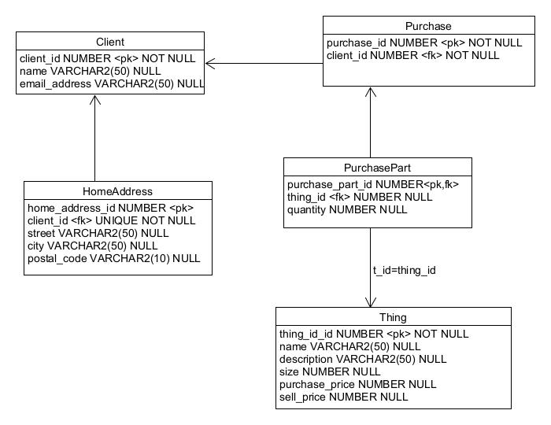

# Ecommerce – SQL Database

This project simulates an e-commerce system using a relational SQL database.  
It includes entities such as clients, products, purchases, and addresses.  
The project demonstrates how to model real-world data, insert realistic test data, create reusable views, and perform insightful queries.

##  Project Structure

- **Database schema**: Tables and relationships
- **Test data**: Python + Faker library
- **Views**: Reusable abstractions for queries
- **Queries**: SELECT statements for data analysis

##  SQL Scripts

- [📄 SQL – Data Definition (DDL)](sql-ddl/create_tables.sql)  
- [📄 SQL – Data Manipulation (DML via Python)](data_generation/connect.py)  
- [📄 SQL – Data Queries (DQL)](sql_queries/sql_dql.sql)  
